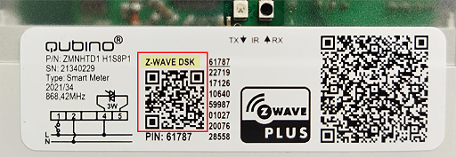
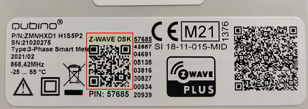
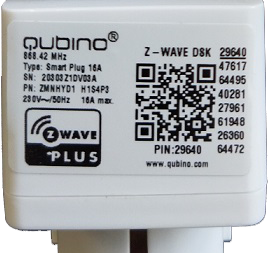
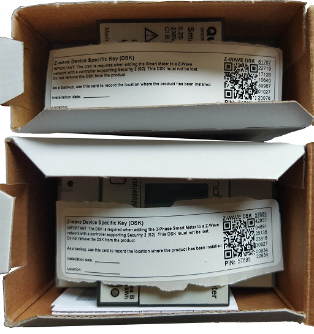
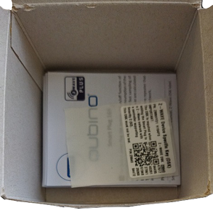

## The latest - last firmware updates for for Qubino devices that support Over-the-Air (OTA) updates.

Before using the newest OTA files, you should know that the older models can’t be updated to the newest firmware. That is because the older models do not have the S2 secure inclusion. This kind of security needs to be hard-coded and this can only be done by the manufacturer.

To find out if your 3-Phase Smart Meter, Smart Meter and Smart Plug supports OTA, you must check the **Z-wave DSK QR code**. It can be found on the label on the side of the device. You can also find it in the device's packaging box. If it has a code, it can be updated. 

The **RGBW dimmer** do not need to be verified as it have the OTA available from the first release on.

### Below are some examples of the QR DSK codes:

Qubino Smart Meter DSK code example 

Qubino 3 Phase Smart Meter DSK code example 

Qubino Smart Plug DSK code example 

Extra labels in the box: 
Smart Meters 
 
Smart Plug  

Another important detail that you must know the frequency at which the Smart Meter works. If you install the wrong one, you will not be able to include the Smart Meter to your gateway afterwards. 

Smart Meters have the firmware that works on EU or Russian frequency.
- Qubino 3 Phase Smart Meter - ZMNHXD1 works on the EU frequency
- Qubino 3 Phase Smart Meter - ZMNHXD4 works on the Russian frequency
- Qubino Smart Meter - ZMNHTD1 works on the EU frequency
- Qubino Smart Meter - ZMNHTD4 works on the Russian frequency
 

Once you have all the information if the device supports the latest OTA update, you may download the files and procede with the update.